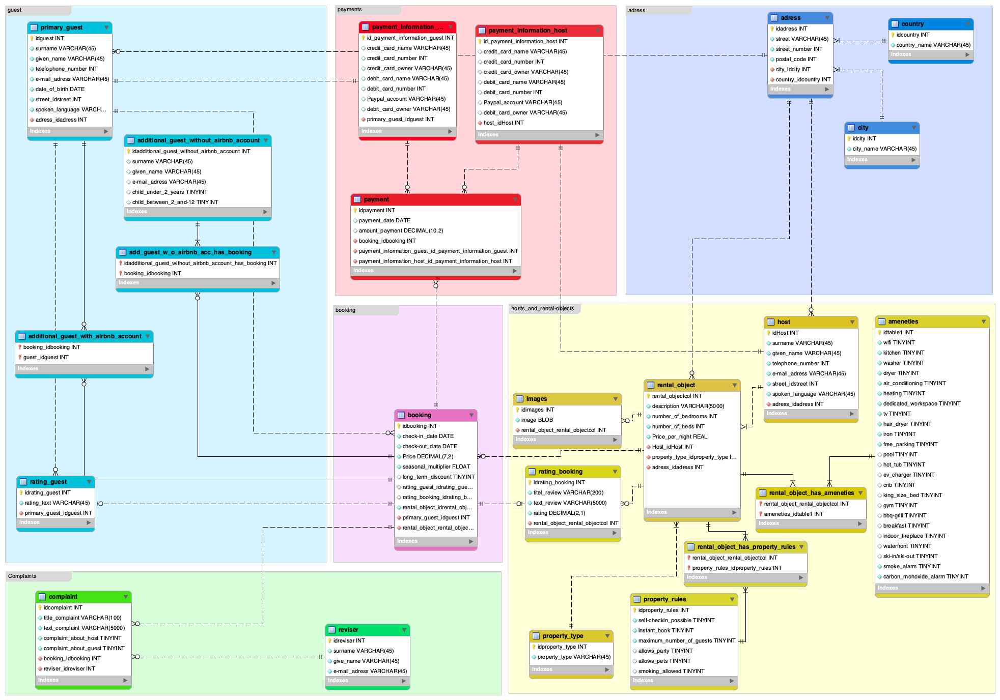

# Airbnb Database Project

## Overview

Welcome to the Airbnb Database Project! This project focuses on designing a comprehensive database schema for an Airbnb-like platform. The schema covers various aspects, including hosts, guests, rental objects, bookings, payments, complaints, and more.

## Table of Contents

- [Schema Overview](#schema-overview)
- [Database Structure](#database-structure)
- [Getting Started](#getting-started)
- [Contributors](#contributors)
- [License](#license)

## Schema Overview

The database is structured to capture key elements of an Airbnb platform, such as hosts, guests, rental properties, bookings, payments, and complaints. It employs foreign keys to establish relationships between different entities.

### Entities

- **City**
- **Country**
- **Address**
- **Host**
- **Property Type**
- **Rental Object**
- **Primary Guest**
- **Rating (Guest and Booking)**
- **Booking**
- **Additional Guests (With and Without Airbnb Accounts)**
- **Payment Information (Guest and Host)**
- **Payment**
- **Reviser**
- **Complaint**
- **Images**
- **Property Rules**
- **Amenities**
- **Rental Object Has Amenities**
- **Rental Object Has Property Rules**

## Database Structure

The database is organized into the Airbnb schema, consisting of multiple tables. Each table represents a specific entity, and relationships are established using foreign key constraints.

### Examples

#### City Table

- Contains information about different cities.

#### Host Table

- Stores details about hosts, including contact information and addresses.

#### Rental Object Table

- Describes each rental property, including its type, location, and host details.

#### Booking Table

- Manages booking information, such as check-in and check-out dates, prices, and guest details.

### SQL Script

You can find the SQL script used for forward engineering in the `schema.sql` file.

## Getting Started

To set up the Airbnb database on your local machine, follow these steps:

1. Execute the SQL script provided in `schema.sql` to create the database and tables.
2. Enjoy

## Contributors

This Airbnb Database Project was created by me.

## License

This project is licensed under the [MIT License](LICENSE.md).
